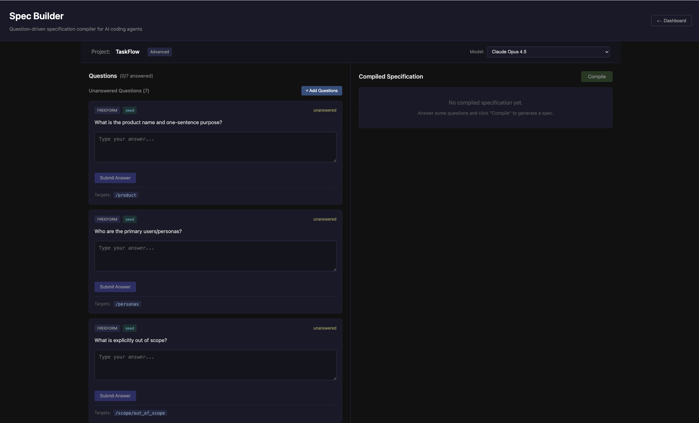

# Spec Builder

A requirements compiler that converts product ideas into formal, machine-usable specifications for AI coding agents. Spec Builder uses LLMs as constrained compilers (not chatbots) with strict structured outputs.



## Overview

Spec Builder guides you through a structured question-and-answer process to elicit product requirements, then compiles your answers into a comprehensive specification that AI coding agents (Claude Code, Cursor, Codex, etc.) can consume directly.

**Key Features:**
- Question-driven spec elicitation with AI-generated follow-up questions
- AI-powered answer suggestions for unanswered questions
- Versioned answers with full edit history
- Real-time spec compilation with SSE streaming
- Validation and issue tracking with issue-to-question linking
- Visual exploration of spec structure
- Export of AI-coder-ready artifact bundles in multiple formats (AI Coder Pack, Ralph)

## Architecture

```
┌─────────────────────────────────────────────────────────────────┐
│                         Frontend (React)                         │
│  ┌──────────────┐  ┌──────────────────┐  ┌──────────────────┐  │
│  │   Question   │  │  Spec Workspace  │  │   Issues Panel   │  │
│  │    Ledger    │  │  (JSON/Markdown) │  │                  │  │
│  └──────────────┘  └──────────────────┘  └──────────────────┘  │
└─────────────────────────────────────────────────────────────────┘
                              │ HTTP API
┌─────────────────────────────────────────────────────────────────┐
│                         Backend (Go)                             │
│  ┌──────────────┐  ┌──────────────────┐  ┌──────────────────┐  │
│  │   SQLite     │  │ LLM Orchestration│  │ Schema Validation│  │
│  │ Persistence  │  │ (OpenAI/Gemini/  │  │                  │  │
│  │              │  │    Anthropic)    │  │                  │  │
│  └──────────────┘  └──────────────────┘  └──────────────────┘  │
└─────────────────────────────────────────────────────────────────┘
```

**Critical constraint:** All LLM calls happen in the backend. The frontend is a pure consumer with no LLM calls or canonical state.

## Prerequisites

**For Docker (recommended):**
- **Docker** with Docker Compose — [Download](https://docs.docker.com/get-docker/)
- **LLM API Key** (at least one)

**For local development:**
- **Go 1.22+** — [Download](https://go.dev/dl/)
- **Node.js 18+** — [Download](https://nodejs.org/)
- **LLM API Key** (at least one):
  - Google Gemini: `GEMINI_API_KEY`
  - OpenAI: `OPENAI_API_KEY`
  - Anthropic: `ANTHROPIC_API_KEY`

## Quick Start

### Option A: Docker (Recommended)

The easiest way to run Spec Builder:

```bash
# Clone the repository
git clone https://github.com/dshills/specbuilder.git
cd specbuilder

# Set up your API key
cp .env.example .env
# Edit .env and add at least one API key

# Run with Docker Compose
docker compose up --build
```

Open http://localhost:3080 and start building your spec.

### Option B: Local Development

#### 1. Clone the repository

```bash
git clone https://github.com/dshills/specbuilder.git
cd specbuilder
```

#### 2. Set up environment variables

Create a `.env` file in the project root or export the variables:

```bash
# Required: At least one LLM API key
export GEMINI_API_KEY="your-gemini-api-key"     # Preferred
# OR
export OPENAI_API_KEY="your-openai-api-key"
# OR
export ANTHROPIC_API_KEY="your-anthropic-api-key"

# Optional configuration
export PORT=8080                                 # Backend port (default: 8080)
export DB_PATH="./data/specbuilder.db"          # Database path (default: data/specbuilder.db)
```

#### 3. Build and run

```bash
# Build both backend and frontend
make build

# Run the backend server (in one terminal)
make backend-run

# Run the frontend dev server (in another terminal)
make frontend-run
```

The application will be available at:
- **Frontend:** http://localhost:5173
- **Backend API:** http://localhost:8080

### Create your first project

1. Open the app in your browser (http://localhost:3080 for Docker, http://localhost:5173 for local dev)
2. Click "Create Project" and enter a name
3. Answer the initial seed questions about your product
4. Click "Add Questions" to generate follow-up questions based on your answers
5. Continue answering questions until your spec is complete
6. Export your AI Coder Pack when ready

## Available Commands

Run `make help` to see all available commands:

```
Usage: make [target]

Targets:
  all             Build backend and frontend (default)
  build           Build backend and frontend
  test            Run all tests
  clean           Remove build artifacts
  dev             Show instructions for development
  fmt             Format Go code
  lint            Run golangci-lint on backend
  generate        Run go generate

Backend:
  backend-build   Build the Go server
  backend-test    Run backend tests
  backend-run     Run backend server

Frontend:
  frontend-build  Build React frontend
  frontend-test   Run frontend tests
  frontend-run    Start frontend dev server

Docker:
  docker-build    Build Docker image
  docker-up       Start container (detached)
  docker-down     Stop container
  docker-rebuild  Force rebuild and restart
  docker-logs     View container logs
  docker-clean    Stop and remove volumes
```

## Project Structure

```
specbuilder/
├── backend/                 # Go backend server
│   ├── cmd/server/         # Main entry point
│   └── internal/
│       ├── api/            # HTTP handlers and middleware
│       ├── compiler/       # LLM-based spec compiler
│       ├── diff/           # Snapshot diffing
│       ├── domain/         # Domain types and errors
│       ├── export/         # AI Coder Pack export
│       ├── llm/            # LLM provider abstraction
│       ├── repository/     # Data persistence (SQLite)
│       └── validator/      # Schema validation
├── frontend/               # React + TypeScript frontend
│   └── src/
│       ├── api/           # Backend API client
│       ├── components/    # React components
│       └── types/         # TypeScript types
├── docker/                # Docker configuration
│   ├── nginx.conf        # Nginx reverse proxy config
│   └── entrypoint.sh     # Container startup script
├── contracts/             # API and schema contracts
│   ├── api/              # OpenAPI specification
│   └── spec/             # ProjectImplementationSpec JSON Schema
├── specs/                 # Product specification
│   ├── SPEC.json         # Canonical product requirements
│   └── PLAN.md           # Implementation milestones
└── examples/             # Example answers for testing
```

## How It Works

### The Compilation Pipeline

1. **Planner** — Analyzes current answers and identifies missing spec areas
2. **Asker** — Generates constrained questions with types, tags, and affected spec paths
3. **Compiler** — Transforms Q&A into a structured ProjectImplementationSpec + trace mappings
4. **Validator** — Detects schema violations and semantic issues

### Domain Model

- **Project** — Container for a specification being built
- **Question** — A clarifying question with type (single/multi/freeform), options, and spec path mappings
- **Answer** — Immutable, versioned responses to questions (editing creates new versions)
- **Snapshot** — Append-only compiled specifications with full traceability
- **Issue** — Validation problems (missing, conflict, assumption) with severity levels

### Key Invariants

1. **Answer immutability** — Editing creates a new answer with `version=prev+1` and `supersedes=prevAnswerId`
2. **Snapshot append-only** — Snapshots are never updated in place
3. **Trace coverage** — Every populated spec field must have provenance in the trace
4. **Deterministic compilation** — Same inputs produce identical spec output

## Export Formats

When your spec is complete, export it in one of two formats optimized for different AI coding workflows.

### AI Coder Pack (Default)

The standard export format containing:

| File | Description |
|------|-------------|
| `SPEC.json` | Complete structured specification |
| `SPEC.md` | Human-readable Markdown version |
| `PLAN.md` | Implementation plan with milestones |
| `TRACE.json` | Maps spec paths to source answers |
| `DECISIONS.md` | Compilation metadata and assumptions |
| `ACCEPTANCE.md` | Acceptance criteria |

This pack is designed to be directly consumable by AI coding agents like Claude Code, Cursor, and Codex.

### Ralph Format

Optimized for the [Ralph autonomous development loop](https://github.com/dshills/ralph-claude-code), this format provides structured files for continuous AI-driven development:

| File | Description |
|------|-------------|
| `PROMPT.md` | Agent instructions with objectives, principles, and status reporting |
| `@fix_plan.md` | Prioritized task list with checkbox format (High/Medium/Low) |
| `@AGENT.md` | Build instructions and quality gates |
| `specs/requirements.md` | Technical specifications derived from your answers |
| `specs/SPEC.json` | Full specification for reference |

The Ralph format includes:
- **RALPH_STATUS block** for machine-readable progress reporting
- **EXIT_SIGNAL** instructions for clean session termination
- **Priority-based task organization** for autonomous work selection
- **Quality gates** ensuring tests pass before feature completion

## API Endpoints

| Method | Path | Description |
|--------|------|-------------|
| `POST` | `/projects` | Create a new project |
| `GET` | `/projects/{id}` | Get project details |
| `GET` | `/projects/{id}/questions` | List all questions |
| `POST` | `/projects/{id}/next-questions` | Generate new questions via LLM |
| `POST` | `/projects/{id}/answers` | Submit or edit an answer |
| `POST` | `/projects/{id}/compile` | Trigger explicit compilation |
| `GET` | `/projects/{id}/snapshots` | List all snapshots |
| `GET` | `/projects/{id}/snapshots/{sid}` | Get snapshot with issues |
| `GET` | `/projects/{id}/snapshots/{sid}/diff/{other}` | Compare two snapshots |
| `POST` | `/projects/{id}/export` | Generate AI Coder Pack zip |
| `GET` | `/health` | Health check |

## Configuration

### Environment Variables

| Variable | Default | Description |
|----------|---------|-------------|
| `PORT` | `8080` | Backend server port |
| `DB_PATH` | `data/specbuilder.db` | SQLite database path |
| `GEMINI_API_KEY` | — | Google Gemini API key (preferred) |
| `OPENAI_API_KEY` | — | OpenAI API key |
| `ANTHROPIC_API_KEY` | — | Anthropic API key |
| `SPECBUILDER_LLM_PROVIDER` | — | Override LLM provider (`gemini`, `openai`, `anthropic`) |
| `SPECBUILDER_LLM_MODEL` | — | Override default model for the selected provider |

### LLM Provider Priority

The backend will use the first available provider in this order:
1. Google Gemini (`GEMINI_API_KEY`)
2. OpenAI (`OPENAI_API_KEY`)
3. Anthropic (`ANTHROPIC_API_KEY`)

The server will start without an LLM key, but compilation endpoints will be disabled.

## Docker

### Running with Docker Compose

Use the Makefile targets for common operations:

```bash
# Build and start (detached)
make docker-up

# View logs
make docker-logs

# Stop the application
make docker-down

# Force rebuild and restart (no cache)
make docker-rebuild

# Stop and remove data volume
make docker-clean
```

Or use docker compose directly:

```bash
# Start the application
docker compose up --build

# Run in detached mode
docker compose up -d --build

# View logs
docker compose logs -f

# Stop the application
docker compose down

# Stop and remove data volume
docker compose down -v
```

### Environment Variables

Docker reads API keys from a `.env` file or your shell environment:

```bash
# Option 1: Use .env file
cp .env.example .env
# Edit .env and add your keys

# Option 2: Pass from shell
export GEMINI_API_KEY=your-key
docker compose up --build
```

### Data Persistence

SQLite data is stored in a Docker volume (`specbuilder-data`). To backup:

```bash
docker run --rm -v specbuilder-data:/data -v $(pwd):/backup alpine \
  cp /data/specbuilder.db /backup/specbuilder-backup.db
```

### Plain Docker (without Compose)

```bash
docker build -t specbuilder .
docker run -p 3080:3080 \
  --env-file .env \
  -v specbuilder-data:/app/data \
  specbuilder
```

## Development

### Running Tests

```bash
# Run all tests
make test

# Run backend tests only
make backend-test

# Run frontend tests only
make frontend-test
```

### Code Formatting

```bash
# Format Go code
make fmt

# Lint Go code (requires golangci-lint)
make lint

# Lint frontend (from frontend directory)
cd frontend && npm run lint
```

### Hot Reload (Development)

The backend supports hot reload using [Air](https://github.com/cosmtrek/air):

```bash
cd backend
air
```

## Contributing

Contributions are welcome! Please ensure:

1. All tests pass (`make test`)
2. Code is formatted (`make fmt`)
3. New features include appropriate tests
4. Domain invariants are respected (see CLAUDE.md for details)

## License

This project is licensed under the MIT License - see the [LICENSE](LICENSE) file for details.

## Acknowledgments

Built to streamline the handoff between product thinking and AI-assisted development.
